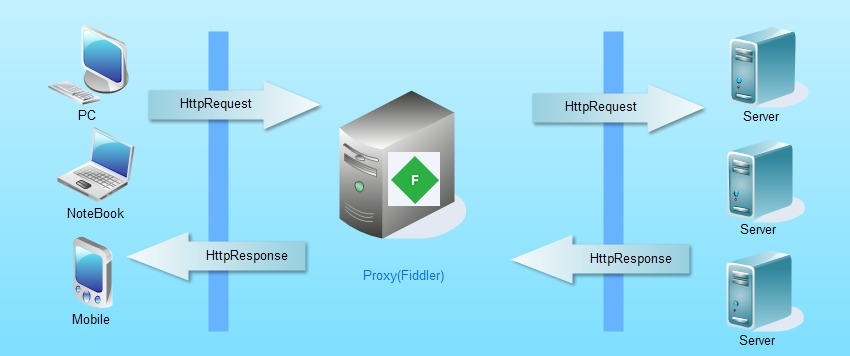
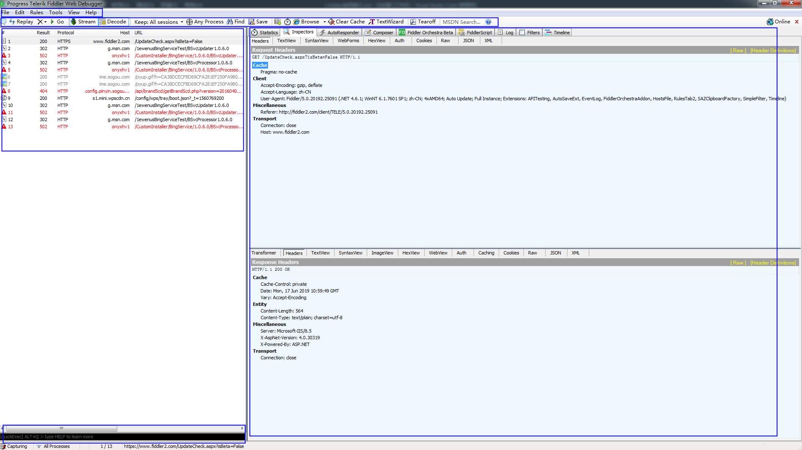

Fiddler使用说明

### 一、简介
>Fiddler（中文名称：小提琴）是一个HTTP的调试代理，以代理服务器的方式，监听系统的Http网络数据流动，Fiddler可以也可以让你检查所有的HTTP通讯，设置断点，以及Fiddle所有的“进出”的数据，Fiddler还包含一个简单却功能强大的基于JScript .NET事件脚本子系统，它可以支持众多的HTTP调试任务。

### 二、工作原理
>Fiddler是以代理WEB服务器的形式工作的,浏览器与服务器之间通过建立TCP连接以HTTP协议进行通信，浏览器默认通过自己发送HTTP请求到服务器，它使用代理地址:127.0.0.1, 端口:8888. 当Fiddler开启会自动设置代理， 退出的时候它会自动注销代理，这样就不会影响别的程序。不过如果Fiddler非正常退出，这时候因为Fiddler没有自动注销，会造成网页无法访问。解决的办法是重新启动下Fiddler。

### 三、界面简介
>Fiddler的主界面分为工具面板、会话面板、监控面板、状态面板。
#####主界面

#####工具面板

工具栏从左到右按钮功能分别为：

    1.增加备注——选中某个会话，点击按钮，可对会话添加备注
    2.回放按钮——选中某个会话，点击按钮，回放对该会话的请求。快捷键为R
    3.清空监控面板
    4.调试Debug
    5.模式切换——在流模式和缓冲模式之间切换，默认缓冲模式
    6.解压请求——将HTTPS的请求解压，以便查看
    7.保持会话——考虑电脑性能，自行选择
    8.过滤请求——按下按钮不放，选择要捕获的软件进程，松开按钮，即可捕捉到该软件发出的所有请求
    9.查找——点击，输入想查找的会话
    10.保存会话
    11.保存截图
    12.计时器
    13.快速启动浏览器
    14.清除缓存
    15.编码/解码

#####会话面板

1.#：表示记录来自服务器端的请求会话
2.Result：表示会话状态
3.Protocol：表示协议
4.Host：表示主机地址/域名

#####监控面板

#####状态面板

>使用QuickExec

### 四、常用功能
**1.Fiddler捕获HTTPS会话**
>默认下，Fiddler不会捕获HTTPS会话，需要你设置下, 打开Tools->Options->HTTPS

[Fiddler界面中文概述](https://www.cnblogs.com/sjl179947253/p/7620524.html)

[Fiddler使用教程](http://www.aseoe.com/special/webstart/fiddler/#c4)

[Fiddler官方文档](https://docs.telerik.com/fiddler/KnowledgeBase/FiddlerScript/ModifyRequestOrResponse)

[Android抓包方法-之Fiddler代理](https://www.cnblogs.com/findyou/p/3491014.html)